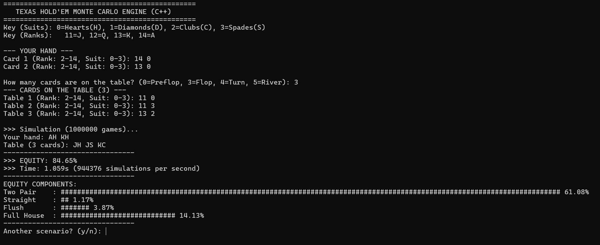

# Monte-Carlo-Poker-Engine
This project is a C++ console application that estimates hand strength (equity) in Texas Hold'em poker. 
It utilizes the Monte Carlo method, running n (set to 1,000,000) randomized game simulations to approximate the win rate.

## Demo Input and Output



## Key Features

* **Equity Estimation:** Runs 1,000,000 simulations to determine win/tie percentages with high statistical confidence.
* **Game Stages:** Supports analysis for Pre-flop, Flop, Turn, and River (allows input of known board cards).
* **Deep Statistical Analysis:** Decomposes total equity into winning hand components (e.g., how much a Flush contributes to the total win rate vs. a Pair).
* **Input Validation:** Checks for valid card inputs and prevents duplicate cards (collision detection).

## Technical Implementation

* **Algorithm:** The hand evaluator uses a Frequency Array approach to check hand strength in O(N) time. This avoids sorting the cards ($O(N \log N)$), significantly improving performance.
* **Performance:** Capable of processing over 1,000,000 hands per second on a single core using standard C++ optimization (`-O3`).
* **Stack:** C++17, STL (Standard Template Library).

## How to Run

1.  Compile the code using g++:
    ```bash
    g++ poker.cpp -o poker -std=c++17 -O3
    ```

2.  Run the executable:
    ```bash
    ./poker
    ```
    (Or `poker.exe` on Windows)
